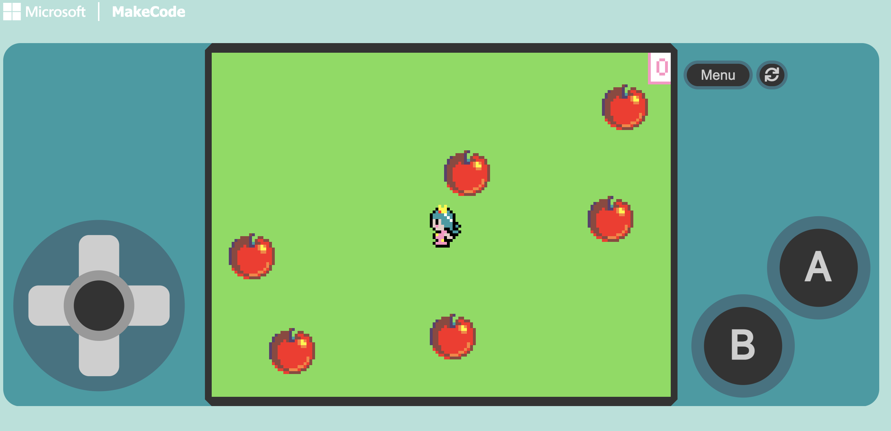

# Apple Collector Series!
Welcome to the Apple Collector Series! 

In these tutorials, you'll create a simple game where a player collects apples appearing at random locations. 
Each tutorial will increase in difficulty. Build one at a time to improve your skills!

## Prerequisites

- A web browser
- Access to [MakeCode Arcade](https://arcade.makecode.com/)

## Tutorial 1

- [Play The Game](https://makecode.com/_FDaX0sMwJeUq)
- [Beginner Tutorial](https://arcade.makecode.com/#tutorial:https://arcade.makecode.com/S68594-76102-74159-14936)

## Tutorial 2

- [Play The Game](https://makecode.com/_bH5a9pTCA0kW)
- [Intermediate Tutorial](https://arcade.makecode.com/#tutorial:https://arcade.makecode.com/S20564-11538-46933-54784)

## Tutorial 3

- [Play The Game](https://makecode.com/_Ei8KjzCgtCT2)
- [Advanced Tutorial](https://arcade.makecode.com/#tutorial:https://arcade.makecode.com/S89143-39531-48088-57720)

## Challenge

Can you modify the game to:
- Make the apples dissapear if you don't grab them?
- Add different types of objects worth different points?
- Add power-ups?

---

[Back to Home](/)
