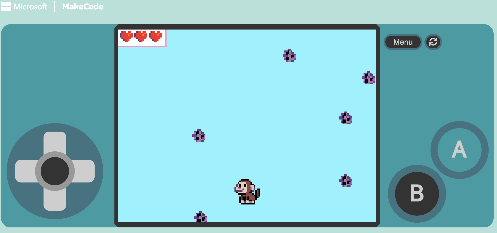

# Dodge Game Series!
Welcome to the Dodge Game Series!

In these tutorials, you'll create fast-paced dodge games where the player must avoid falling obstacles.
Each tutorial increases in difficulty, helping you build stronger game design and coding skills in MakeCode Arcade.

## Prerequisites

- A web browser
- Access to [MakeCode Arcade](https://arcade.makecode.com/)

## Tutorial 1

- [Play The Game](https://makecode.com/_ac9h8J5xxKJ4)
- [Beginner Tutorial](https://arcade.makecode.com/#tutorial:https://arcade.makecode.com/S85248-02341-18799-96894)

## Tutorial 2

- [Play The Game](https://makecode.com/_WMuJe1959U3k)
- [Intermediate Tutorial](https://arcade.makecode.com/#tutorial:https://arcade.makecode.com/S45786-85834-43815-80537)

## Tutorial 3

- [Play The Game](LINK_GOES_HERE)
- [Advanced Tutorial](TUTORIAL_LINK_GOES_HERE)

## Challenge

Can you modify the game to:
- Make enemies fall faster over time?
- Add a score that increases the longer you survive?
- Add different enemy types with different speeds?
- Add power-ups like shields or slow motion?

---

[Back to Home](/)
