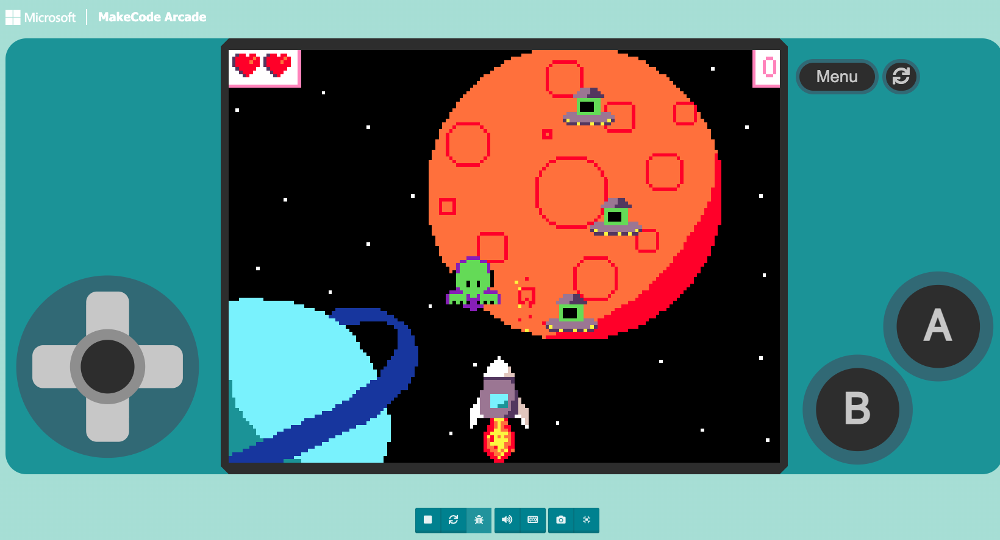

# Space Invaders Series!
Welcome to the SSeries! 

In these tutorials, you'll create a simple game where a player collects apples appearing at random locations. 
Each tutorial will increase in difficulty. Build one at a time to improve your skills!

## Prerequisites

- A web browser
- Access to [MakeCode Arcade](https://arcade.makecode.com/)

## Tutorial 1

- [Play The Game](https://arcade.makecode.com/S64502-76991-70789-38562)
- [Beginner Tutorial](https://arcade.makecode.com/#tutorial:github:ruizosvaldo/league_spaceinvaders/tutorial)

## Tutorial 2

- Under Construction

## Tutorial 3

- Under Construction

## Challenge

---

[Back to Home](/)
